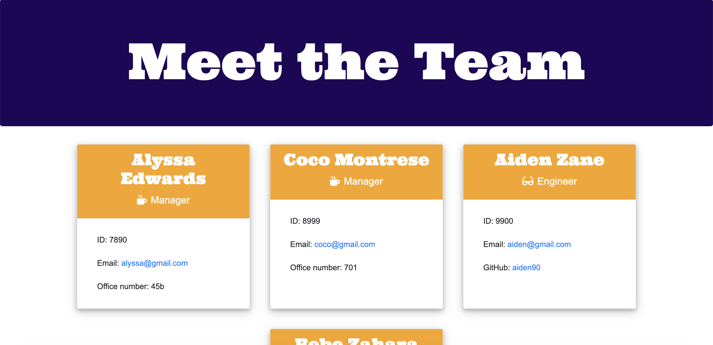

# Engineering-Team-Generator README

# Table of contents
1. [Project Description](#descriptionLink)
2. [Installation](#installationLink)
3. [Usage](#usageLink)
4. [Rendered Page UI](#uiLink)
5. [Version](#versionLink)
6. [Dependencies](#dependenciesLink)
7. [Contact](#contactLink)


----

## Project Descripton <a name="descriptionLink"></a>
This CLI app takes user-provided info to dynamically create a formatted Engineering Team Profile page.

## Installation <a name="installationLink"></a>
Clone repo.

## Usage <a name="usageLink"></a>
In the terminal, run ```node app.js```


## Rendered Page UI <a name="uiLink"></a>



## Version <a name="versionLink"></a>


## Dependencies <a name="dependenciesLink"></a>
-Jest (for testing)

-Joi (for validating)

-Inquirer 

-Badges in ReadME provided by Shields.io

-Fonts from googlefonts.com


## Contact <a name="contactLink"></a>


#### Github Username: [@reyesdmusic](https://www.github.com/reyesdmusic)
#### Email: vdannyreyes@gmail.com
